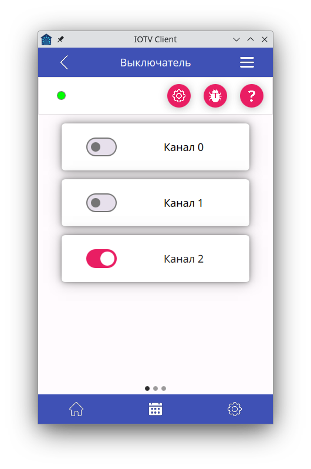
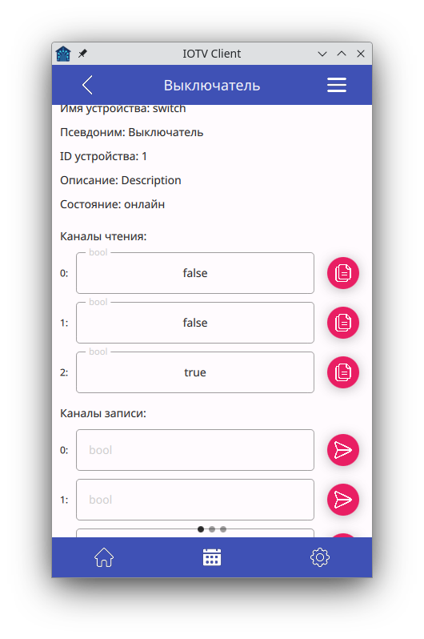
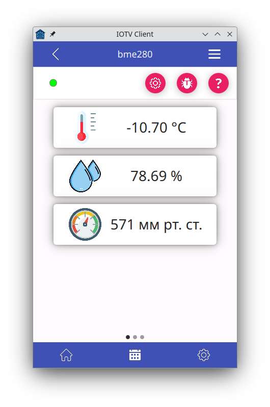
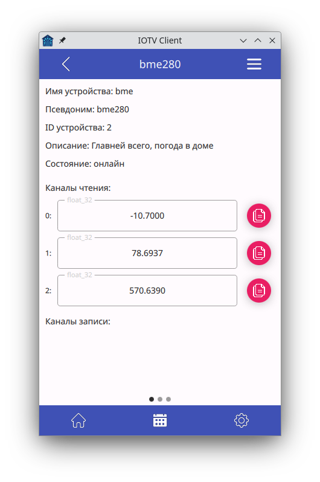
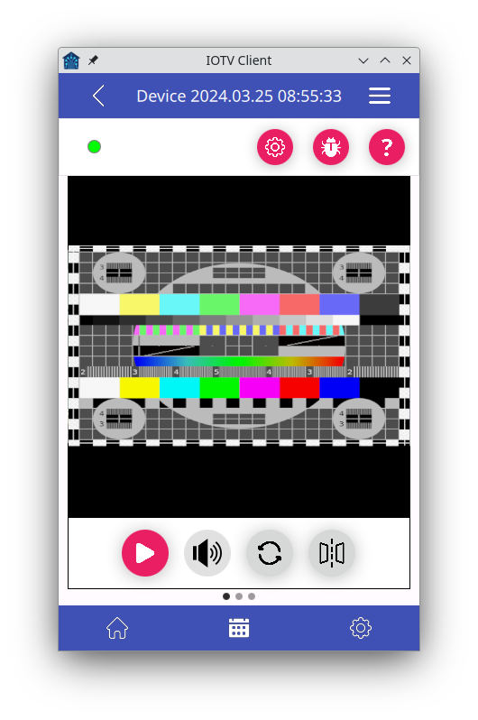

<h1>IOTV</h1>

    Централизированная система управления устройствами. Под устройствами (хостами) могут подразумеваться как автономные устройства на микроконтроллерах, так и отдельные программы на компьютерах.
    Протокол для общения хоста-сервера-клиента написан на Си, так что его легко можно использовать практически на любых микроконтроллерах. На серверной части используется телеграм бот.

    Проект состоит из трёх основных частей:
<ol>
    <li>IOTV_Server.</li>
    <li>IOTV_Host.</li>
    <li>IOTV_Client.</li>
</ol>

<h2>1. IOTV_Server</h2>
<ul>
    <li>Слушает выбранный tcp порт для связи с клиентами (файл настроек).</li>
    <li>Слушает tcp и udp порты для связи с tcp/udp хостами (файл настроек). Так же возможны другие типы подключений, такие как com-порт и текствый файл.</li>
    <li>Слушает broadcast для автоматического определения tcp/udp хостов в локальной сети (файл настроек).</li>
    <li>Считывает из файла ностроек данные по хостам, к которым необходимо подключиться (адрес, порт, тип подключения и др.)</li>
</ul>

<h3>События:</h3>

На сервере можно создавать события хостов следующего типа:

<ul>
    <li>Подключене.</li>
    <li>Отключение.</li>
    <li>Состояние.</li>
    <li>Данные.</li>
    <li>Будильник.</li>
    <li>Таймер.</li>
</ul>

<h3>Действия:</h3>

Для реагирования на события создаются действия следующих типов:

<ul>
    <li><b>Data_tx</b> - отправка конкретных данных на конретное устройство.</li>
    <li><b>Data_tx_ref</b> - пересылка данных с одного устройства на другое.</li>
</ul>

События и действия создаютс с помощью IOTV_Client приложения.

<h2>2. IOTV_Host</h2>
<ul>
    <li><b>TCP, UDP</b> - вариант работы в режиме ожидания подключения сервера по tcp/udp порту.</li>
    <li><b>TCP_REVERSE</b> - указания хосту адреса сервера для подключения.</li>
    <li><b>Broadcast</b> - вариант broadcast рассылки для обнаружения сервером данного хоста и подключения к нему по tcp/udp порту.</li>
</ul>

<h2>3. IOTV_Client</h2>
<ul>
    <li>GUI приложение для связи с сервером. Получение данных о количестве устройств, их типе, получение/отправка данных на устройствства.</li>
    <li>Графический интерфейс разрабатывается с приоритетом использования приложения на мобильных устройствах. В первую очередь на Android смартфонах.</li>
</ul>

<h2>Конфигурационные файлы IOTV_Server</h2>

    На стороне сервера создаётся 3 .ini файла настроек:
<ul>
    <li><b>IOTV_Server.ini, секция [SERVER]:</b></li>
    <ul>
        <li><b>address</b> - ipv4 адрес, на ктором будет работать сетевая часть приложения.</li>
        <li><b>broadcastListener</b> - udp порт, на котором сервер будет слушать широковещательную рассылку от хостов.</li>
        <li><b>portClients</b> - tcp порт для подключения клиентов.</li>
        <li><b>portHosts</b> - указание tcp порта для подключения хостов <b>TCP_REVERSE</b></li>
        <li><b>client_log</b> - лог файл подключенных в данный момент клиентов.</li>
        <li><b>default_log</b> - лог файл по умолчанию. В данный файл записывается вся информация при работе программы.</li>
        <li><b>event_action_log</b> - лог файл Событий и действий.</li>
        <li><b>max_client</b> - максимальное количество одновременно подключенных клиентов.</li>
        <li><b>max_host</b> - максимальное количество одновременно подключенных хостов.</li>
    </ul>
     
    <li><b>IOTV_Server.ini, секция [TG_BOT]:</b></li>
    <ul>
        <li><b>tgbot_log</b> - лог файл работы бота.</li>
        <li><b>tgbot_token</b> - токен бота.</li>
        <li><b>tgbot_trust_clients</b> - txt файл со списком id доверенных клиентов.</li>
    </ul>
</ul>
<ul>
    <li><b>IOTV_Hosts.ini</b> - файл хостов, к которым должен подключаться сервер. Описание одного хоста состоит из следующих полей:</li>
    <ul>
        <li><b>[name]</b> имя хоста. Имя в файле должно быть уникальным.</li>
        <li><b>address</b> - ipv4 адрес хоста.</li>
        <li><b>port</b>  - номер udp или tcp порта.</li>
        <li><b>connection_type</b> - тип подключения (TCP, UDP).</li>
        <li><b>interval</b> - интервал (в миллисекундах) считывания сервером данных с хоста. Минимальный интервал программно не может быть меньше 100 мс.</li>
        <li><b>logDir</b> - каталог для лог файлов данных хоста.</li>
    </ul>
</ul>
<ul>
    <li><b>IOTV_Event_Action.json</b> - файл событий и действий. Не нуждается в ручной правке. Настройка производится с IOTV_Client приложения.</li>
</ul>

<h2>Зависимости:</h2>
<ul>
    <li>C++20.</li>
    <li>CMake.</li>
    <li>Qt 6.</li>
    <li><a href="https://github.com/reo7sp/tgbot-cpp">tgbot-cpp.</a></li>
</ul>

<h2>Сборка:</h2>

Каждый хост имеет обязательные поля:
<ul>
    <li>id устройства.</li>
    <li>имя устройства.</li>
    <li>описание устройства.</li>
</ul>
ID устройства необходимо для определение графического интерфейса на стороне клиента. Список устройств смотреть в файле <b>IOTV/docs/Список устройств.odt</b>

Каждый хост имеет два канала данных - <b>канал чтения</b> и <b>канал записи</b>. Каналы, в свою очередь, состоят из вектора блоков <b>(подканалов)</b>. Минимальное количество таких блоков - <b>0</b>, максимальное - <b>255</b>. Любой блок (подканал) должен быть одним из следующих типов:
    <ul>
        <li><b>INT_8</b> - целочисленный знаковый, 1 байт.</li>
        <li><b>INT_16</b> - целочисленный знаковый, 2 байта.</li>
        <li><b>INT_32</b> - целочисленный знаковый, 4 байта.</li>
        <li><b>INT_64</b> - целочисленный знаковый, 8 байт.</li>
        <li><b>FLOAT_32</b> - вещественный, 4 байта.</li>
        <li><b>DOUBLE_64</b> - вещественный, 8 байт. (на разных МК тип double может быть 32-битный)</li>
        <li><b>BOOL</b> - логический тип данных.</li>
        <li><b>STRING</b> - строка. Массив байт интерпретируемый как строка</li>
        <li><b>RAW</b> - Массив байт.</li>
        <li><b>NONE</b> - тип данных отсутствует.</li>
    </ul>

<h3>Примеры описывающие работу с каналами данных.</h3> 

<h3>Пример 1</h3> 

Есть устройство с 3-я лампочками (реле или прочее оборудование, которое может быть в двух состояниях). На данном устройстве на канале чтения и канале записи имеется по 3 подканала. Каждый подканал имеет тип данных <b>BOOL</b>. Что бы считать данные о 1-й лампочке - необходимо получить данные с канала чтения 0-го подканала. Что бы считать данные о 2-й лампочке - необходимо получить данные с канала чтения 1-го подканала и т.д. Что бы включить 3-ю лампочку, необходимо в канал записи во 2-й подканал записать <b>true</b> или <b>1</b> и т.д:

    

        
        
    

<h3>Пример 2</h3> 

Есть устройство с 3-я датчикам (температура, влажность, давление). На данном устройстве на канале чтения имеется 3 подканала, на канале записи - 0 подканалов. Каждый подканал имеет тип данных <b>FLOAT_32</b>. Что бы считать данные температуры - необходимо получить данные с канала чтения 0-го подканала. Что бы считать данные влажности - необходимо получить данные с канала чтения 1-го подканала. Что бы считать данные давления - необходимо получить данные с канала чтения 2-го подканала:

    

        
        
    

<h3>Пример 3</h3> 

Большое количество подканалов и их разные типы можно использовать для создания более сложных решений. Как пример, онлайн камера:

    

        
    

